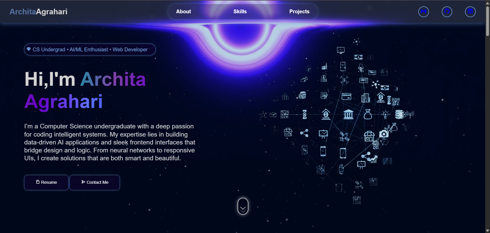

# 💻 Archita Agrahari — Personal Portfolio

Welcome to my personal portfolio website!  
This is a fully responsive and animated portfolio built with **HTML, CSS, JavaScript**, and integrated with **AI/ML project showcases** and **GitHub Pages** deployment.

 <!-- Add your preview image path -->

---

## 🚀 Live Website

👉 [Visit Portfolio](https://architaagrahari.github.io/YourRepoName)

---

## 🧠 About Me

I'm a **Computer Science undergraduate** passionate about building intelligent systems and visually compelling user experiences. My interests lie at the intersection of:

- **Machine Learning & Deep Learning**
- **Artificial Intelligence**
- **Frontend Development**
- **Problem Solving & DSA**

From developing **audio-to-sign language translators** to **stock market forecasting models** and **art marketplaces**, I bring ideas to life through code and design.

---

## 📁 Features

- Responsive multi-section design
- Animated skill sliders & project videos
- Interactive GitHub project links
- Functional contact form (via FormSubmit)
- Deployed using GitHub Pages

---

## 🔧 Tech Stack

- **Languages**: HTML, CSS, JavaScript, Python, C++, SQL  
- **Frameworks & Libraries**: Flask, TensorFlow, Scikit-learn, OpenCV, MediaPipe  
- **Tools**: VS Code, Figma, GitHub, Streamlit, Jupyter Notebook  
- **Deployment**: GitHub Pages, FormSubmit

---

## 📂 Project Highlights

| Project                              | Description                                                                                      |
|--------------------------------------|--------------------------------------------------------------------------------------------------|
| 🎨 Artistry Market                   | Full-stack marketplace for artists using Flask + SQL + JS. Responsive UI and auction features.  |
| 🤖 SignBridge (Audio → ISL)          | Real-time translator converting speech to Indian Sign Language using deep learning.             |
| 📊 Customer Churn Prediction         | ML model with interactive Streamlit dashboard for telecom churn analysis.                       |
| 📈 Stock Analysis (LSTM + GPT-2)     | Hybrid AI system combining time series forecasting and NLP sentiment using financial news.      |

---

## 📬 Contact

Want to collaborate or just say hello?

- 📧 Email: [architaagrahari8100@gmail.com](mailto:architaagrahari8100@gmail.com)  
- 🔗 [LinkedIn](https://www.linkedin.com/in/archita-agrahari-b148ab255/)  
- 💻 [GitHub](https://github.com/ArchitaAgrahari)

---

## 🛠️ Run Locally

Clone the repository:

```bash
git clone https://github.com/ArchitaAgrahari/your-repo-name.git
cd your-repo-name


